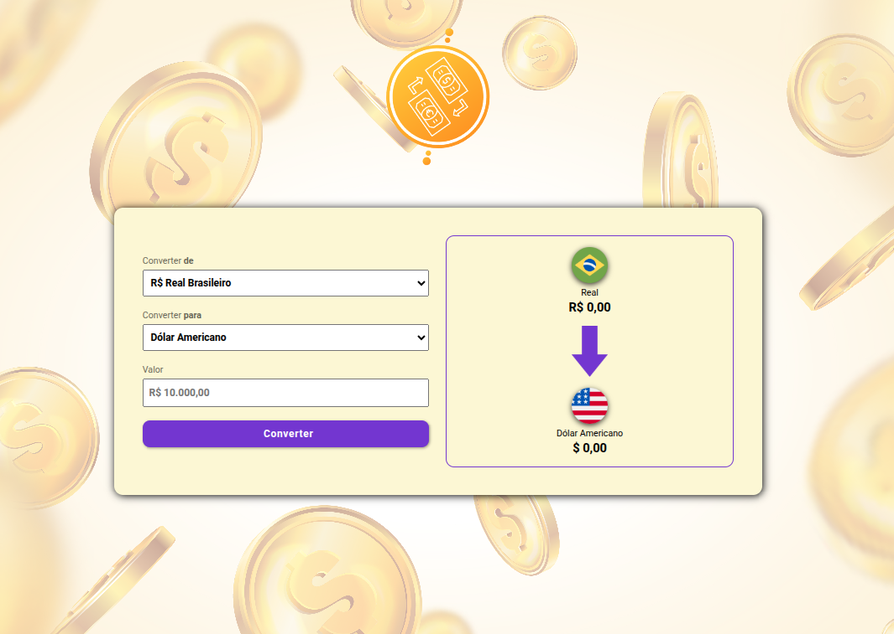
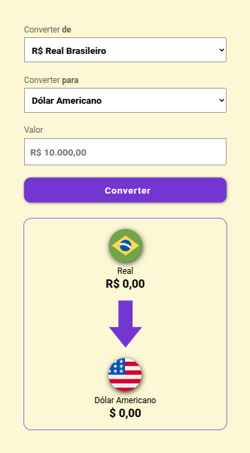

# 💱 Conversor de Moedas Atualizado 

<table>
      <tr>
        <th>
          
        </th>
        <th>
          
        </th>
      </tr>
    </table>

## 🚀 Acesse o projeto

👉 **[Visualize a aplicação online](https://leandrodevlab.github.io/conversor-de-moedas/)**  
_(Não requer instalação — abra direto no navegador.)_

**Conversor de Moedas** é uma aplicação web simples desenvolvida com **HTML, CSS e JavaScript**, que permite converter valores em **Reais (BRL)** para **Dólar Americano (USD)** e **Euro (EUR)**.  
O foco do projeto é demonstrar domínio de lógica de programação, manipulação de DOM, boas práticas de código e uso de atributos dinâmicos para tornar o comportamento mais escalável.

---

## 📌 Funcionalidades

✔ Conversão de valores reais (R$) para moedas estrangeiras  
✔ Exibição de resultado formatado corretamente como moeda  
✔ Alteração de bandeira e nome da moeda selecionada  
✔ Uso de atributos HTML (`data-`) para tornar a lógica de conversão configurável sem hardcode no JavaScript

---

## 🧠 Principais Técnicas Aplicadas

O projeto fortalece os seguintes conceitos de front-end:

- Manipulação do DOM com JavaScript
- Escuta de eventos (`click` e `change`)
- Uso de `Intl.NumberFormat` para formatação de moedas
- Estrutura de funções organizadas e fácil manutenção
- Uso de atributos `data-*` para parametrizar lógica sem ifs repetidos
- Organização de projeto com estrutura de pastas limpa

---

## 🧑‍💻 Autor

**Leandro Sávio Oliota Ribeiro**  
Front-end Developer

[LinkedIn](https://www.linkedin.com/in/leandrosoribeiro/) • [Portfólio](https://leandrodevlab.github.io/)

## 🚀 Como Usar

1. Clone o repositório:
   ```bash
   git clone https://github.com/LeandroDevLab/conversor-de-moedas.git
   ```
